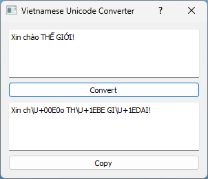

# Vietnamese Unicode Converter
This is a tool used to convert Vietnamese characters to \\U+xxxx patterns. Only works with composed Unicode for now.

<p align="center">
  
</p>

## Prerequisites
Microsoft Visual C++ 14.0 or greater


## Install requirements
```sh
pip install -r requirements.txt
```
If you have issue when install PyQt5_sip, this [thread](https://forum.qt.io/topic/90839/lnk1158-cannot-run-rc-exe) should help

## Run
```sh
python gui.py
```
